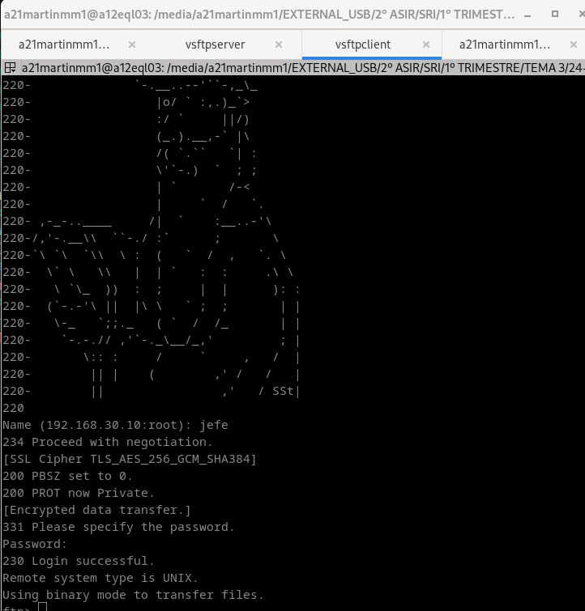

## O obxectivo desta tarefa é instalar o servidor FTP vsftpd nun equipo Ubuntu Server/Debian

## Tomaremos a máquina gandalf dos exercicios anteriores.

## Instala o paquete vsftpd e configurao da seguinte maneira:

## 1. A mensaxe de benvida debe ser un ASCII Art da personaxe "Gandalf o Gris"

## 2. Habilita o permiso de escritura aos usuarios locais. Cando suban ficheiros, deben perder o permiso de execución para o grupo e para outros.

## 3. Impide o acceso de todos os usuarios locais fora do seu diectorio home permitindo que poidan escribir so no directorio public_html do seu directorio home.

## 4. Habilita o acceso anónimo no directorio /sauron, permitindo subir ficheiros e crear directorios. O propietario de tales ficheiros debe ser o usuario saruman

## 5. Instala un certificado dixital, para poder encriptar as transferencias. Probao instalando o paquete ftp-ssl nun cliente.

## 6. Habilita límites do ancho de banda dos usuarios, limitandoas a 10 Mb/s por usuario.

## 7. Establece como tempo de inactividade máximo 60 segundos, e de tempo de inactividade nas transferencias 90 segundos.

## 8. Non poderán conectarse máis de 4 sesións simultaneas nin máis de 2 por enderezo IP do cliente.

## 9. Establece o ficheiro de log, en /var/log/ftp.log

## Autocorrección

1. Pode verse a mensaxe de benvida, cando se conecta un usuario.
2. Os usuarios poden subir ficheiros. Os ficheiros perden o permiso de execución pero conservan o de escritura.
3. Os usuairos locais aparecen aillados, e no poden subir ficheiros ao seu directorio home, pero si ao directorio public_html
4. O usuario anonymous pode entrar e ver o contido do directorio /sauron. O usuario anonymous pode subir ficheiros e crear directorios, e o seu propietario e o usuario saruman.
5. O cliente, ten as conexións encriptadas.
6. Despoois de 60 segundos as conexións deberían estar pechadas
7. Se se fan 5 conexións simultaneas (necesitas 3 equipos), a 5ª non pode conectar. A 3ª desde un mesmo equipo, tampouco consigue conectar.
8. Aparece un log de conexións en /var/log/ftp.log
